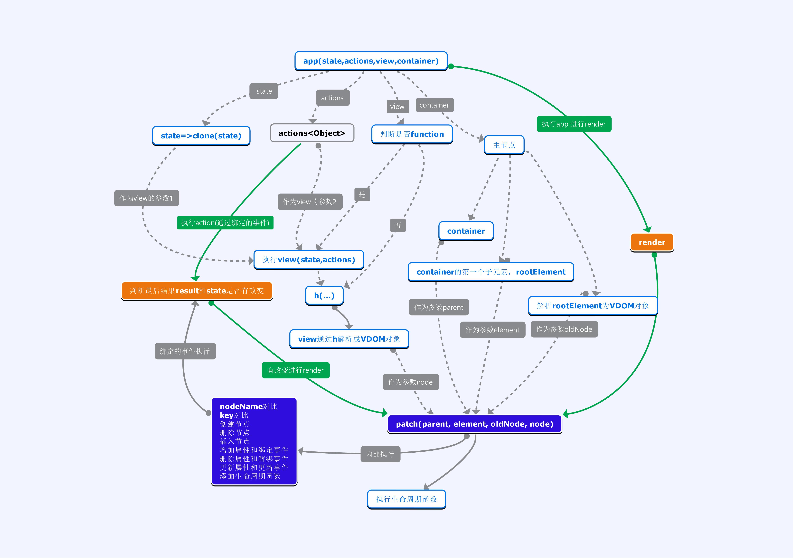
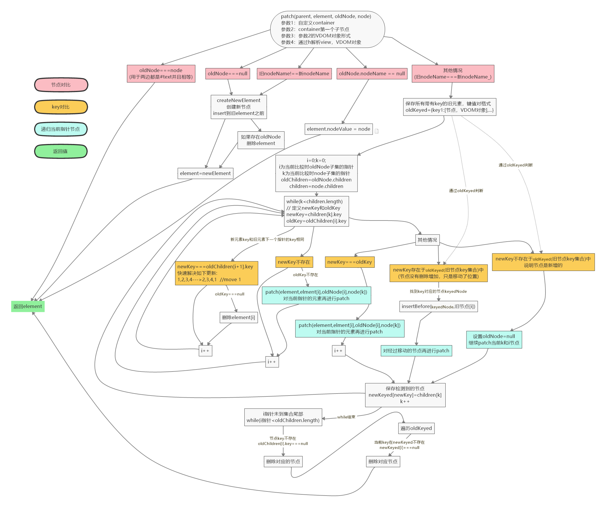

# source-code.hyperapp

一个极小的(1kb)类react框架，实现了virtual-dom，diff比较(需要key)，数据绑定到actions上，通过actions改变数据，会自动更新页面

主要步骤：
* 通过app()对其参数进行处理
* 克隆state（不在原state上修改）
* 增强actions，当调用时会自动检查结果result和原state是否有变化，有变化进行render
* 将state和增强actions绑定到view上
* 初始化render，执行patch

patch是hyperapp进行节点更新的核心，主要步骤：
* 先判断node节点
* 当节点相同--->进行key判断--->递归patch，直到指针到尾部
* 最后判断是否需要删除节点
* 返回更新的element

思维导图(整体)：

思维导图(patch)：

[具体源码](./src/hyperapp.js)