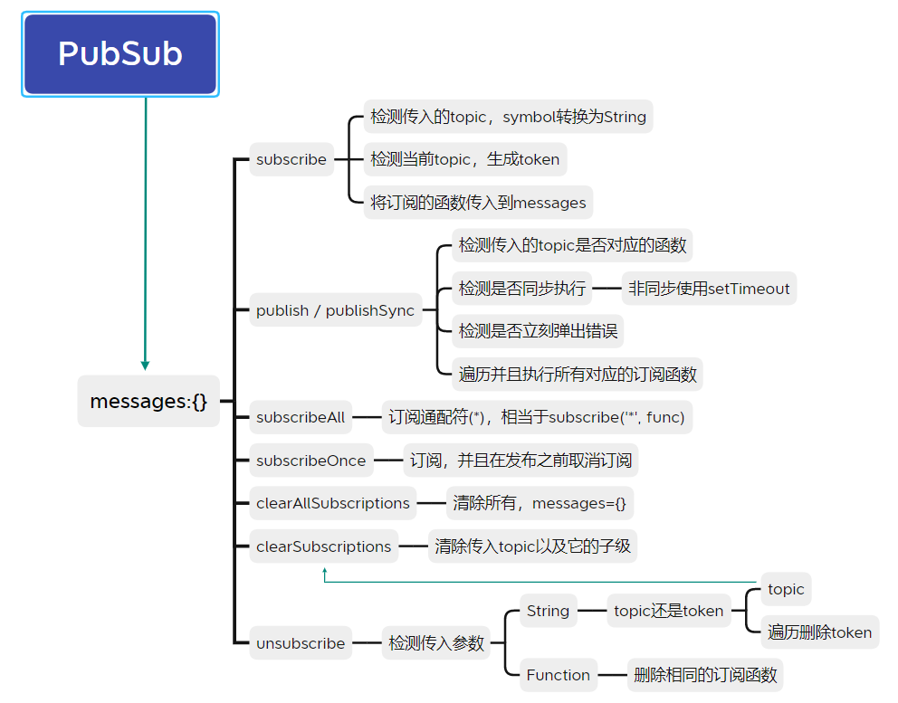

> pubsub-js: 一个用 JavaScript 编写的`基于主题`的发布/订阅库


-----

`pubsub-js`代码量不大，代码逻辑也较简单，也确实完成了一个发布订阅库，基于`javascript`的`key:value`普通对象。

代码结构
```js
messages={
   topic1:{
        token1_1:Function,
        token1_2:Function,
    }, 
   topic2:{
        token2_1:Function,
        token2_2:Function,
        ...
    }, 
    ...
}
```

这个`基于主题`结构，允许对同一个主题进行多次不同的订阅，因此每次订阅会返回一个`token`可以通过`unsubscribe`对
`token`取消订阅，

`unsubscribe`也接收`topic`(主题的名称)，对当前主题下所有`token`取消订阅，也接收`function`，删除所有与参数一致的订阅函数。

同时`pubsub-js`也提供了层级订阅，通过`.`进行分级，例如当订阅了`a`和`a.b`时，发布`a.b`同时也会触发`a`的订阅，而通配符`*`则表示任何发布都将触发它的订阅。

> **注意：`pubsub-js`是一个简单的发布订阅库，并不能解决真正的异步问题。**

----

思维导图：



