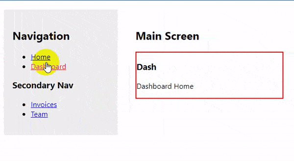

# source-code.reach-router
v1.1.1

## 初识

一张导图：


对几个亮点进行说明：

* 匹配顺序

源码中是使用了一个评分的方法：
1. 先对路径去除头尾的`/` ，并且按`/`分割成路径片段数组
2. 对数组使用reduce方法计算分值，如下：
```
let SEGMENT_POINTS = 4;     // 基本分值，每一个路径片段都有
let STATIC_POINTS = 3;      // 静态路径，如：/abc
let DYNAMIC_POINTS = 2;     // 动态路径，如：/:section
let SPLAT_PENALTY = 1;      // 通配符（减分），如：/*，此处遇到通配符会先减去基本分值，再减1分（优先权很低）
let ROOT_POINTS = 1;        // 根路径
```
可知优先权排序为：

静态路径 > 动态路径 > 根路径 > 通配符

* 相对路径

涉及到3个方法：

`./index.js-->createRoute`

`./lib/utils.js-->resolve`

`./lib/util.js-->pick`

首先是通过`basepath`(一个Router自定义属性，用作路径的公共前缀)结合每一个children(即Route Component)的path通过`createRoute`方法计算出一个绝对路径

再通过`pick`方法与当前`pathname`(即window.location.pathname)进行匹配，计算得出一个非通配(*)路径匹配值(baseuri)，`例如：'a/*' -->匹配出 basuri:'/a'`

这个baseuri会作为`BaseContext`(React.createContext)的context传递给内部组件，最后使用`resolve`方法对Link上的to的路径(可能是绝对路径，也可能是相对路径)搭配`baseuri`进行解析(转换成绝对路径)，并且跳转


* 自动focus

对屏幕阅读器特别友好，每次通过Link跳转后，会自动focus到当前跳转对应的Component，也就是不需要再通过大量的tab按钮去寻找内容页面

## 深入
首先看源码最后，输出了什么：
```
export {
  Link,
  Location,
  LocationProvider,
  Match,
  Redirect,
  Router,
  ServerLocation,
  createHistory,
  createMemorySource,
  isRedirect,
  navigate,
  redirectTo
};
```
而这些输出的组件有些是方法，有些是组件，它们的构造基本围绕着3个context，就是导图中的蓝，绿，红

关于React中Provider和Consumer的2个特性：
1. Consumer会获取离它最近的父元素Provider的context
2. 每当Provider内部value改变，其内部的Consumer都会被重新渲染

源码中对context结构的书写，都是Consumer包裹Provider，这就能形成：
`最外层无context(无defaultValue的情况)，而嵌套层能获取上一层的Provider`

因此对这3个context分析：

* BaseContext

context有默认值 "/"：

`basepath       //公共前缀路径，自定义`

`baseuri        //非通配匹配路径，自动对路径匹配计算得出`


只有Router包含BaseContext.Provider(在`RouterImpl`中渲染)

`RouterImpl`对每一个children(Route Component)进行当前`location`路径匹配，匹配成功的路径作为`BaseContext`的context，
如果children内部还有children，会使用一个新的`Router -->primary=true`包裹内部的children

因此只有被Router包裹的内部的标签才能获取到context值（当前的动态的basepath和baseuri）

而Router外部的标签或者Router本身则为默认值"/"

* LocationContext

context无默认值

`location       //pushState的"state"，"key"(时间戳)，window.location的"pathname"和"search"`

`navigate        //一个跳转方法，默认使用pushState，每次跳转都会自动更新location`

首次渲染会加载`LocationProvider`，后续加载会直接调用`children(contnext)`，

而`LocationProvider`通过history的listen方法绑定了每次调用navigate都会更新location，返回值是`Provider`，传递了location和navigate给context

由于首次渲染是Router组件，Router中context为undefined，但它加载`LocationProvider`计算出context，
后续渲染的组件则能获取到`Provider`的context

* FocusContext

context无默认值

`requestFocus       // 是否需要自动获取焦点`

在`BaseContext.Provider`内部渲染，而且要检查Router组件的`primary`属性是否为true，`primary`为true会渲染`FocusHandler`，否则默认渲染div

`FocusHandler`内部就是Consumer包裹`FocusHandlerImpl`，通过pathname和uri进行判定，满足2个条件确定当前组件的`shouldFocus`属性为true：
1. url路径有变动
2. 不为通配符(*)匹配路径，可以是动态匹配(:section)

当`shouldFocus`为true，便可通过context(即requestFocus)进行获取焦点，这里this.node就是这个`FocusHandlerImpl`返回值(div)的ref
```js
 if (requestFocus) {
      requestFocus(this.node);
    } else {
  /*...*/
    }
```

再看`requestFocus`内部：
```js
requestFocus = node => {
    // 内部判断shouldFocus要为false
    if (!this.state.shouldFocus) {
      node.focus();
    }
  };
```
内部判断`shouldFocus`要为false又是怎么回事呢？

注意，此处的this是箭头函数静态绑定，也就是通过context传过来时的this，也就是父级FocusHandlerImpl的this

而当子级的uri变化时，父级的uri是不变的（如果在同一个父级下），因此父级的`shouldFocus`是false，触发子级dom的focus

如果不在同一个父级下，例如从父级a的子级a1, 直接跳转到父级b的子级b1，那么父级uri不同，父级的`shouldFocus`为true，不触发子级dom的focus

而再去判断父级的父级的uri是否相等，当判断相同，父级的父级的`shouldFocus`为false，因此会触发父级(b)dom的focus

见动图：



[例子源码](https://codesandbox.io/s/lpv0165m1q)

---
* history

其实大部分方法和组件都贯穿于上面3个context中，另还有一个history.js主要做了以下事情：

1. 判断当前平台，如果非浏览器，则模拟一个history对象，
2. 新建一个location方法，里面有pathname，search，state(pushState的参数1),key(跳转的时间戳)
3. 创建一个navigate方法，用于跳转，内部默认使用pushState和replaceState，会自动更新上面location对象
4. export

## 流程
当点击Link--->调用navigate--->内部调用pushState--->更新当前location--->Router会更新context为最新的location
--->Router中将children的路径与当前pathname匹配--->匹配成功的进行配置props和渲染

