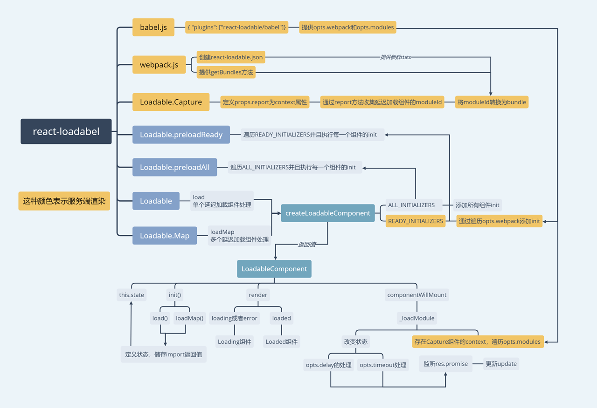

### 介绍
[react-loadable](https://github.com/jamiebuilds/react-loadable)是一个组件延迟加载的工具，
它本身也是一个组件，通过`HOC`的方式对参数组件进行处理，
具体的延迟加载方式是使用`import().then()`方法，那么为什么要用这个组件呢？

### 初识

`react-loadable`针对多种情况进行抽象处理，例如延迟加载失败，多个延迟加载的逻辑和服务端渲染使用延迟加载...

当这些情况整合起来后，我们只需要简单的API即可处理每个情况对应的组件。

它对外暴露的API有
```
// 基本的延迟加载处理
Loadable
// 多个延迟加载处理
Loadable.Map
// Loadable或Loadable.Map的返回值
LoadableComponent
// 预加载
LoadableComponent.preLoad
// 全部预加载
Loadable.preloadAll
// 对已经加载完毕的组件处理
Loadable.preloadReady
// 服务端渲染使用
Loadable.Capture
```
Loadable和Loadable.Map还可加入一些options参数，作用如下：
```
// 延迟加载组件
loader: null,
// loading组件
loading: null,
// 加载组件时等待多少时间才开始渲染Loading
delay: 200,
// 超时时间
timeout: null,
// 对已加载的组件渲染方法
render: render,

/* 以下2个是服务端渲染使用 */

// 函数，执行后会获取当前延迟加载模块
// 这里用途是判断模块是否已经可用，作用于 preLoadReady 上
webpack: null,
// 函数，执行后会获取当前import的路径，作为moduleId
// 这里用途是通过getBundles将moduleId转换成bundles
modules: null
```

### 深入

#### Loadable
客户端的单个延迟加载组件

当开始载入`Loadable`组件，会返回`LoadableComponent`组件，这个组件在生命周期中的`constructor`下会执行`init`方法。

```jsx harmony
 return class LoadableComponent extends React.Component {
    constructor(props) {
      super(props);
      init();

  /* ... */
```

这个`init`方法会执行`loadFn(opts.loader)`，而这个`loadFn`会首先会执行`参数loader(也就是import(...))`，并且将根据`执行结果(then或者catch)`对3个状态`loading`,`loaded`,`error`进行更新，
返回一个包含所有状态和import执行结果的对象；

init：
```jsx harmony
function init() {
  if (!res) {
    // loadFn就是load
    // 这里opts.loader就是组件的延迟加载函数，例如：()=>import(./xxx)
    res = loadFn(opts.loader);
  }
  // 返回延迟加载的component
  return res.promise;
}
```
loadFn：
```jsx harmony
function load(loader) {
  // promise保存了延迟加载组件执行的返回值(thenable)
  let promise = loader();
  // 状态数据
  let state = {
    loading: true,
    loaded: null,
    error: null
  };
  // state.promise是一个Promise的处理返回值
  // 此处根据promise的返回值，更新状态数据
  state.promise = promise
    .then(loaded => {
      state.loading = false;
      state.loaded = loaded;
      return loaded;
    })
    .catch(err => {
      state.loading = false;
      state.error = err;
      throw err;
    });

  // state是一个obj，保存了状态和延迟加载组件执行的返回值
  return state;
}
```

接着在`componentWillMount`下调用了`this._loadModule`，它会根据`options`里的参数(例如delay，timeout)对当前状态进行更新，并且继续监听`init`返回的对象，一旦处理完毕，更新状态。

```jsx harmony
// 载入组件时，根据options加载和更新
componentWillMount() {
  this._mounted = true;
  this._loadModule();
}

_loadModule(){
  /* 省略了服务端渲染的处理 */ 
  
  // 延迟加载结束
  if (!res.loading) {
    return;
  }

  // 默认200ms后更新pastDelay
  // 有时组件加载非常快(<200ms)，这时加载中的样式就会一闪而过
  // 因此可以选择默认隔200ms后才开始渲染loading(避免样式闪动)，这样做是因为能让用户感觉更快
  // https://github.com/jamiebuilds/react-loadable#avoiding-flash-of-loading-component
  if (typeof opts.delay === "number") {
    if (opts.delay === 0) {
      this.setState({ pastDelay: true });
    } else {
      this._delay = setTimeout(() => {
        this.setState({ pastDelay: true });
      }, opts.delay);
    }
  }

  // 判断是否需要更新timeout(用于超时处理)
  if (typeof opts.timeout === "number") {
    this._timeout = setTimeout(() => {
      this.setState({ timedOut: true });
    }, opts.timeout);
  }

  let update = () => {
    // 当组件未载入或者已经卸载，则返回
    if (!this._mounted) {
      return;
    }

    this.setState({
      error: res.error,
      loaded: res.loaded,
      loading: res.loading
    });

    this._clearTimeouts();
  };

  // res是init()处理后的返回值
  // promise属性对应的是组件延迟加载的返回值
  res.promise
    .then(() => {
      // 加载完毕后，执行update，更新相关状态数据
      update();
    })
    .catch(err => {
      update();
    });
}
```

在`render`里面则根据当前状态，渲染对应的组件(例如`loading`或`error`状态为`true`，都会调用`Loading`组件，并且传递props)。

```jsx harmony
render() {
  // loading或者error状态为true
  if (this.state.loading || this.state.error) {
    // 创建loading组件，第二个参数为props，用于loading渲染的条件
    // loading组件内部根据props定义渲染的内容
    return React.createElement(opts.loading, {
      isLoading: this.state.loading,
      pastDelay: this.state.pastDelay,
      timedOut: this.state.timedOut,
      error: this.state.error,
      retry: this.retry
    });
  } else if (this.state.loaded) {
    // 组件已经加载完毕，渲染延迟加载的组件，render是渲染方法，默认为createElement进行渲染组件
    return opts.render(this.state.loaded, this.props);
  } else {
    return null;
  }
}

 /* 默认的render方法 */

// 兼容babel编译后的组件
function resolve(obj) {
  return obj && obj.__esModule ? obj.default : obj;
}

// 默认的render函数——创建组件
function render(loaded, props) {
  return React.createElement(resolve(loaded), props);
}
```

#### Loadable.Map
多个延迟加载组件的处理

它也是基于单个组件处理的，它的工作逻辑：

只要任何一个组件还在加载，整体的`loading`状态就是`true`，任意一个组件延迟加载出错，整体的`error`状态就是`true`。

```jsx harmony
// 因为遍历并且执行load执行(单个执行)，遇到错误会抛出，因此要try...catch
try {
  Object.keys(obj).forEach(key => {
    let result = load(obj[key]);
    // 第一次判断，目的是改变loading状态
    // 如果某延迟组件加载完毕
    if (!result.loading) {
      // 对应的loaded为true
      // 整体的loading不变
      state.loaded[key] = result.loaded;
      // 任意一个延迟组件有err，整体为err
      state.error = result.error;
    } else {
      // 有任意一个延迟组件还在加载，则整体的loading为true
      state.loading = true;
    }

    // 处理结果(Promise对象)放进数组
    promises.push(result.promise);
  
    // 后续then，目的是处理已经加载完毕的组件
    result.promise
    . then(res => {
        state.loaded[key] = res;
      })
    . catch(err => {
        state.error = err;
      });
  });
  // 捕捉load的错误
  } catch (err) {
  state.error = err;
}
```

使用了`Promise.all()`，等待全部完成后，改变`整体的loading`状态

```jsx harmony
// 当所有组件加载完毕(每个组件可能成功，也可能失败)
// 整体的loading为false
// 有错误则抛出，否则返回state
state.promise = Promise.all(promises)
.then(res => {
  state.loading = false;
  return res;
})
.catch(err => {
  state.loading = false;
  throw err;
});
```

接下来也是`render`的处理了，跟前面没什么不同。


#### Loadable.Capture

服务端渲染的处理

这里要提源码中的`webpack.js`和`babel.js`，这里没有具体分析，只是说明它们的用途。

一个是webpack插件，作用是创建一个json键值对数据`react-loadable.json`，包含了每一个modules对应的bundles，
并且提供了一个将modulesID转换成bundles的方法`getBundles`，简单说就是`将key转换成value`

另一个是babel插件，作用是自动提供2个参数`opts.webpack`和`opts.modules`

```
// 函数，执行后会获取当前延迟加载模块
// 这里用途是判断模块是否已经可用，作用于preLoadReady上
opts.webpack

// 函数，执行后会获取当前import的路径，作为moduleId
// 这里用途是通过getBundles将moduleId转换成bundles
opts.modules
```

有了上面2个概念，`Loadable.Capture`做的事情很简单，

定义了一个`context`属性，并且渲染它的唯一子元素
```jsx harmony
class Capture extends React.Component {
  static propTypes = {
    report: PropTypes.func.isRequired
  };
  // 定义传递给子组件的上下文
  static childContextTypes = {
    loadable: PropTypes.shape({
      report: PropTypes.func.isRequired
    }).isRequired
  };
  // 传递的上下文内容
  getChildContext() {
    return {
      loadable: {
        report: this.props.report
      }
    };
  }
  // 渲染唯一的子元素
  render() {
    return React.Children.only(this.props.children);
  }
}
```
这个context属性一般这么写，这里`modules`是一个空数组

`report={moduleName => modules.push(moduleName)}`

然后在`LoadableComponent`组件内部，如果存在`context属性`并且存在`opts.modules`(说明使用了babel插件)，
则调用`report`。

这里`moduleName`就是`opts.modules`里面每一个`moduleId`，通过`report`方法添加到`modules(空数组)`内部.

```jsx harmony
if (this.context.loadable && Array.isArray(opts.modules)) {
  // 遍历并且对每一个执行report
  opts.modules.forEach(moduleName => {
    this.context.loadable.report(moduleName);
  });
}
```
到现在，`modules`就是一个保存了当前进行延迟加载组件的`moduleId`的数组，再通过`getBundles`(webpack插件提供)方法，
将`moduleId(key)`通过查询`react-loadable.json(包含moduleId对应的bundles)`，转换成`bundles(value)`。

```js
function getBundles(manifest, moduleIds) {
  // moduleIds中每一个作为key，找到manifest[moduleId]合并到bundles(一个数组)中
  return moduleIds.reduce((bundles, moduleId) => {
    return bundles.concat(manifest[moduleId]);
  }, []);
}
```
现在我们得到了一个`bundles`数组，里面储存了我们延迟加载组件对应的`bundle`，我们要做的只是根据`bundle`类型
添加对应的`script标签`或者`link标签`。

#### preLoadReady

因为以上内容都是在服务端上的，客户端必须要等到组件可用了才可以开始渲染，

先提一个变量：`READY_INITIALIZERS`。

它储存了通过检查`opts.webpack`里面每一个`moduleId`对应的组件是可用的，这个组件的`init`方法。

这里`getModuleIds`就是`opts.webpack`
```js
// __webpack_modules__是一个存储了所有模块的对象
  if (typeof __webpack_modules__ !== "object") {
    return false;
  }

  // 检查是否每一个模块存在
  return getModuleIds().every(moduleId => {
    return (
      typeof moduleId !== "undefined" &&
      typeof __webpack_modules__[moduleId] !== "undefined"
    );
  });
```

`preLoadReady`就是通过遍历`READY_INITIALIZERS`数组，并且执行每一个组件的`init`方法，
最终当`Promise.all`全部完成后，就可以开始渲染客户端了。

### 导图总结

