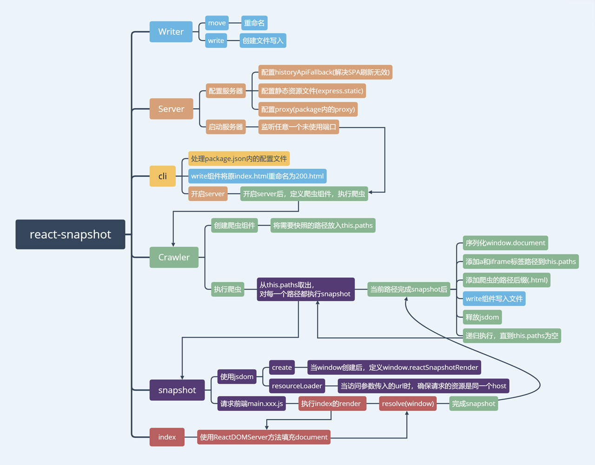

`react-snapshot`一个服务端渲染组件，由于内部依赖库和相关`API`较老，而且有1年没更新了，
就不去太详细解释，有兴趣可以自行看源码内容`src目录`(带详细注释)。

读了这个库，要了解`服务端渲染`是什么流程，因此这里主要讲`执行流程`。

### 配置

这个库需要更改`package.json`的`build`，更改如下：

```
- "build": "react-scripts build"
+ "build": "react-scripts build && react-snapshot"
```

然后改变`render`

```
- import ReactDOM from 'react-dom';
+ import { render } from 'react-snapshot';

- ReactDOM.render(
+ render(
    <App/>,
    document.getElementById('root')
  );
```

### 执行流程

1. 输入`npm run build`，先执行`react-scripts build`，再执行`react-snapshot`

2. 通过`bin`内部文件执行`cli` 
3. 执行`cli`，处理相关配置(目的是转换路径，确认需要快照的页面路径)
    1. 获取`package.json`内部的`homepage`，确保以`/`结尾，如果不存在则用`/`表示。
    2. 将路径转换为绝对路径。
    3. 将`homepage`加入`include`，后面将会不断`.shift()`处理内部的路径。
4. 重命名之前的`index.html`为`200.html`
5. 定义服务器`Server`
    1. 在`build`内部使用了`historyApiFallback`(防止SPA应用404)。
    2. 托管静态`build`内资源到用户定义的`outputFile`中，默认也是`build`。
    3. 处理了存在`proxy`(`package.json`内部的`proxy`)的情况。
6. 开启服务器（使用任意未占用端口）
7. 在上面端口中开启爬虫`Crawler`
    1. 对参数`include`(数组)执行`.shift()`，开始爬行`snapshot`
        1. 使用`jsdom`，创建虚拟dom。
        2. 监听`window`创建，定义`window.reactSnapshotRender`，它的作用是改变一个`flag`。
        
            这个`flag`的改变说明了当前`path`已经成功获取到`js`文件，并且执行了定义在客户端的`render`，已经将`React`
            首页的`document`结构放到了虚拟`document`内部。
        3. 拦截当前`path`上的外部资源请求，查看是否相同的`host`，并且符合`jsdom.feature`的配置。
        
            当资源符合要求，便会请求并且执行(也就是`build`中`xxx.main.js`的代码)，执行它便会触发`render`，
            结果就回到第1步中说的改变`flag`
        
    2. 此时虚拟`document`结构已经生成，经过`scriptJS`检查(匹配则删除)和`window.react_snapshot_state`，
    它的作用是定义一个数据，客户端运行时，能从`window.react_snapshot_state`获取到这个数据。
    3. 序列化这个`document`，检查`document`内部的`<a>`和`<iframe`是否有链接到其他页面或者目录，如果有，添加到`include`中，
    后续执行快照。
8. 给`path`添加`.html`后缀或者(如果是目录添加)`index.html`，创建并且写入文件。
9. 递归到`第7步`继续执行其他路径的快照。

#### 导图


