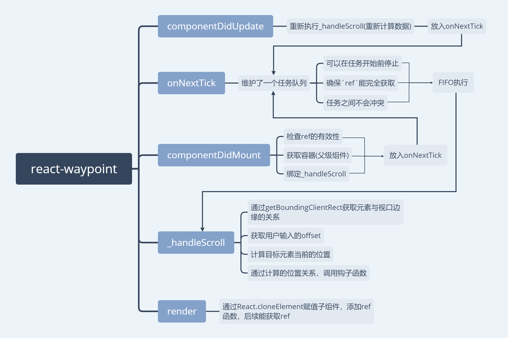

> `react-waypoint`用于监控元素是否出现在用户定义的视口范围内。

### 初识

源码逻辑写的并不复杂，这里基本就不放源码，主要概述一下源码做了些什么事情。

此源码内部相关知识

* `onNextTick`作用和如何定义
* `getBoundingClientRect`的使用
* `getComputedStyle`的作用
* `addEventListener`中`{passive:true}`的作用
* `React.cloneElement`的使用
* 如果用户传递的是`React组件`不是`DOM`，需要编写`ForwardRef`或者`InnerRef`


### 整体流程 

-------

```js
componentWillMount() {
  ensureChildrenIsValid(this.props.children);
}

export default function ensureChildrenIsValid(children) {
  if (children) {
    try {
      React.Children.only(children);
    } catch (e) {
      throw new Error(errorMessage);
    }
  }
}
```
这里组件加载前就通过`React.Children.only`检查用户传入的`children`，保证必须唯一的子元素，并且不能是`TEXT`

--------
在`componentDidMount`内部，

* 使用了`onNextTick`， 一个将任务加入队列执行的方案，通过`setTimeout(()=>{},0)`的使用：

    1. 可以在任务开始前停止。
    2. 确保`ref`能完全获取。
    3. 任务之间不会冲突。

`onNextTick`源码不复杂，却很实用。

```js
let timeout;
const timeoutQueue = [];

export default function onNextTick(cb) {
  // 放入队列
  timeoutQueue.push(cb);
  if (!timeout) {
    timeout = setTimeout(() => {
      timeout = null;
      let item;
      // eslint-disable-next-line no-cond-assign
      while (item = timeoutQueue.shift()) {
        item();
      }
    }, 0);
  }
  let isSubscribed = true;
  // 返回一个取消函数
  return function unsubscribe() {
    if (!isSubscribed) {
      return;
    }
    isSubscribed = false;
    const index = timeoutQueue.indexOf(cb);
    // 需要取消的任务已经执行完毕，发挥
    if (index === -1) {
      return;
    }
    timeoutQueue.splice(index, 1);
    // 如果任务队列无任务 并且 计时器还存在，清除计时器
    if (!timeoutQueue.length && timeout) {
      clearTimeout(timeout);
      timeout = null;
    }
  };
}
```

* 确认ref能有效获取到children

    通过`ref`获取子元素的`DOM`
    
    * 子元素是`DOM`（最容易获取）
    * 子元素是组件，尝试通过`ForwardRef`获取，如果子组件不是`ForwardRef`，通过`innerRef`获取
    
* 父元素获取

    通过子元素的`parentNode`向上遍历，直到找到`overflow`为`auto`或者`scroll`，否则设置为`window`
    
    通过`getComputedStyle`去获取`overflow`的值。（此处并不完美，依赖用户自觉）
    
* 绑定`scroll`和`resize`

    选项`{passive:true}`，这能让浏览器在处理事件时不去检测是否存在`preventDefault`，事件处理更加流畅。
    
-----

接着是`_handleScroll`，即事件绑定的方法

1. 内部存在`_getBounds`和`getCurrentPosition`，作用是判断子元素是否出现在规定范围内

    1. 用户定义2个属性：`topOffset`和`bottomOffset`，可以理解为`上边线`和`下边线`
    
    2. 通过`getBoundingClientRect`，计算出`子元素`顶端和底端到`视口`顶端的距离
    
    3. 通过`上/下边线`和`父元素`的高度和`父元素`顶端到视口顶端的距离，计算出`上/下边线`分别距离视口顶端的距离
    
    4. 对比以上2个数据，分别赋予当前`子元素`的4种位置状态：`invisible`，`inside`，`below`，`above`

2. 通过保存当前位置，每次事件后对比与上一次的位置关系，执行对应的`enter`和`leave`钩子函数。

    一个亮点：`fireOnRapidScroll`，用于判断是否急速滑动。
    
    如果`scroll`执行过快，有可能子元素上一次事件还在`below`，这一次已经是`above`，当出现这样的情况，
    会强制执行`enter`和`leave`事件。

-----

最后是`render`

当组件接收到`this.props.children`，并且`children`本身是一个组件时，无法直接在上面添加属性的，
因为不能这么写`<this.props.children prop={xxx} />`。

例如：

```js
<App>
  <Child />
</App>
```

在不改变输入格式的情况，使用`React.cloneElement`可以修改它的属性，当然原理是复制，意思是内存中存在2个`children`了。

```js
return (
  React.cloneElement(this.props.children,{extraProp:1})
)
```

-----

可能存在的缺陷：

当存在一个很长的`ul`列表，而给`ul`添加了`overflow:auto`，但并未设置`height`，这时`ul`并不是一个滚动组件，
真正的滚动还是触发在`window`，但`waypoint`会因为存在属性`overflow:auto`，而将`ul`认为是滚动组件父元素。

[例子](https://codesandbox.io/s/ly9y4v9m5m)

-----

一张导图作为结尾：

