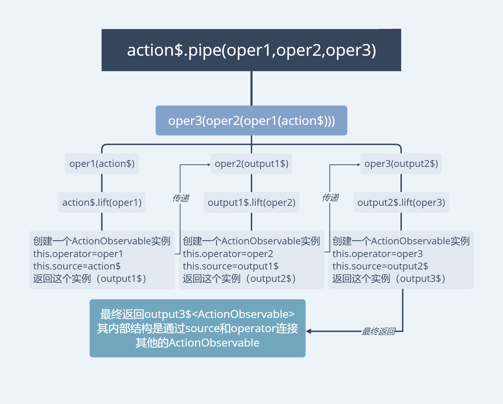
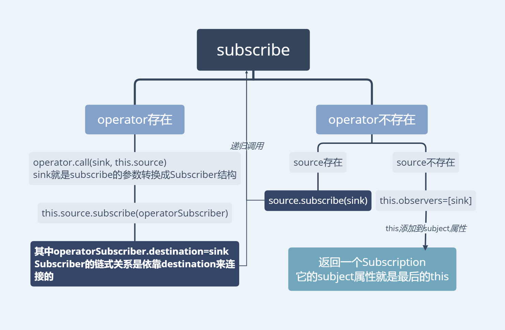
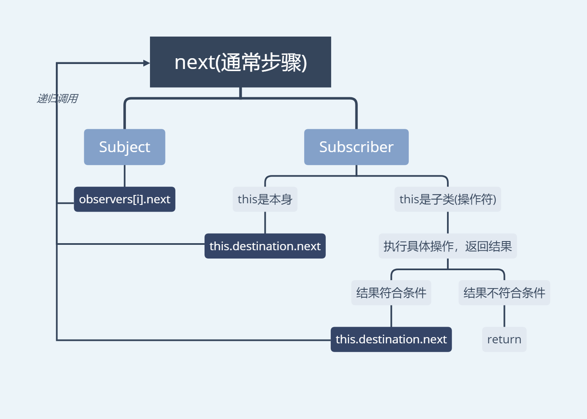
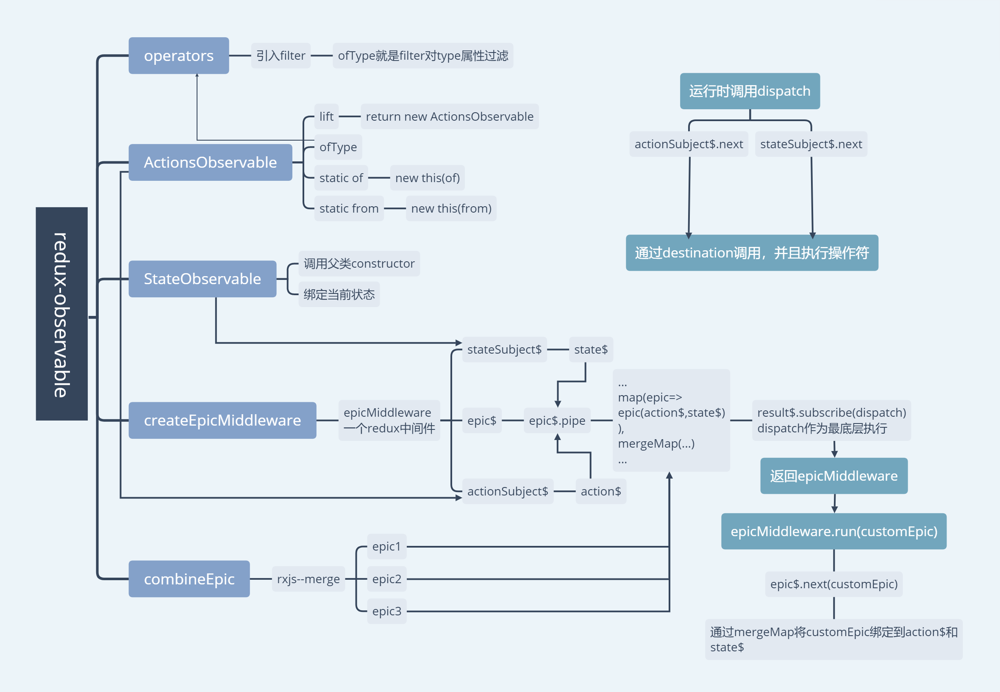

## 阅读前提：
1. 有rxjs基础，对`Observable`, `Subject`,`pipe`和一些操作符(例如`filter`,`map`,`merge`,`mergeMap`)执行流程有基本了解，最起码遇到不清楚有去查阅的动力
2. 比较熟悉`redux`中间件的写法，否则像`createEpicMiddleware.js`中的这一段会搞不清楚
    ```
    return next => {
      return action => {
    ```
    关于redux也可以查阅我之前写的[redux源码注释](https://github.com/stonehank/sourcecode-analysis/tree/master/source-code.redux)
    

## 目录结构

```
src/
├──utils/
    ├──console.js
├── ActionsObservable.js    // 自定义的类，继承Observable, 绑定了操作符的链式调用
├── combineEpics.js         // 
├── createEpicMiddleware.js // 调用可生成redux的中间件, 通过run绑定需要执行的流
├── index.js                // 对外接口
├── operators.js            // 自定义的流操作方法, 目前只有ofType
├── StateObservable.js      // 自定义的类，继承Observable, 用于保存当前state
```


## 源码分析

index.js：公开接口，略

-----

### ActionObservable.js

继承了`Observable`类
```js
export class ActionsObservable extends Observable
```

定义了两个静态函数，用调用的对象包装了原来的`of`和`from`
```js
  static of(...actions) {
    return new this(of(...actions));
  }
  static from(actions, scheduler) {
    return new this(from(actions, scheduler));
  }
```

构造函数，定义了`source`属性为参数，这个属性用来绑定操作符的链式调用
```js
  constructor(actionsSubject) {
    super();
    this.source = actionsSubject;
  }
```
这里重写了父类(Observable)的`lift`，先看一下父类的`lift`是怎样的
```js
var observable = new Observable();
observable.source = this;
observable.operator = operator;
return observable;
```
可以看到改动就在于原来的用`new Observable`，这里使用`new ActionObservable()`，其他都是一模一样，
封装成`ActionObservable`类的意义，统一类型，方便后面的链式绑定

`lift`在`pipe`的时候会用到，其实这都是rxjs源码调用的方式()
```js
lift(operator) {
 const observable = new ActionsObservable(this);
 observable.operator = operator;
 return observable;
}
```
定义了一个操作方法`ofType`，具体见operators
```js
  ofType(...keys) {
    return ofType(...keys)(this);
  }
```

----------------
### combineEpics.js

将多个epic合并成1个epic，就是分别执行每一个epic(绑定用户定义的操作符)，然后将每一个结果的流用merge合并
```js
// 引入merge
import { merge } from 'rxjs';

/**
  Merges all epics into a single one.
 */
export const combineEpics = (...epics) => {
  // 通过merge操作符合并多个epic执行后的output$流
  // ...epics是多个epic
  const merger = (...args) => merge(
    ...epics.map(epic => {
      // 执行每一个epic，确保有返回值，此处执行就是绑定了用户自定义操作符的步骤
      const output$ = epic(...args);
      if (!output$) {
        throw new TypeError(`combineEpics: one of the provided Epics "${epic.name || '<anonymous>'}" does not return a stream. Double check you\'re not missing a return statement!`);
      }
      // 返回结果，最后进行merge合并
      return output$;
    })
  );

  // Technically the `name` property on Function's are supposed to be read-only.
  // While some JS runtimes allow it anyway (so this is useful in debugging)
  // some actually throw an exception when you attempt to do so.
  try {
    Object.defineProperty(merger, 'name', {
      value: `combineEpics(${epics.map(epic => epic.name || '<anonymous>').join(', ')})`,
    });
  } catch (e) {}

  return merger;
};
```
--------------
### createEpicMiddleware.js

一、提示目前参数不在接受`rootEpic`，而是使用`epicMiddleware.run(rootEpic)`，这里`epicMiddleware`就是执行`createEpicMiddleware`的返回值
```js
export function createEpicMiddleware(options = {}) {
  if (process.env.NODE_ENV !== 'production' && typeof options === 'function') {
    throw new TypeError('Providing your root Epic to `createEpicMiddleware(rootEpic)` is no longer supported, instead use `epicMiddleware.run(rootEpic)`\n\nLearn more: https://redux-observable.js.org/MIGRATION.html#setting-up-the-middleware');
  }
  /*...*/
}
```
二、这一定义了几个重要变量(流)，这里一个重要问题
```
1. rxjs内部的source是什么(在ActionObservable内部出现)
2. rxjs内部的operator是什么(在ActionObservable内部出现)
A：source定义了操作符执行的流向，operator定义了操作符是什么操作符，这两者结合使用来进行链式绑定
```
接着看注释
```js
export function createEpicMiddleware(options = {}) {
  /*...*/
  // 定义一个Subject，绑定内部操作流，通过调用epic$.next()，也就是`epicMiddleware.run`来初始化action$的绑定
  const epic$ = new Subject();
  let store;
  // 作为redux的中间件，其中epicMiddleware是返回值作为外部API
  const epicMiddleware = _store => {
    // 当在开发环境并且多次使用不同的 createEpicMiddleware返回值，会提出警告(避免重复执行多次)
    if (process.env.NODE_ENV !== 'production' && store) {
      // https://github.com/redux-observable/redux-observable/issues/389
      require('./utils/console').warn('this middleware is already associated with a store. createEpicMiddleware should be called for every store.\n\nLearn more: https://goo.gl/2GQ7Da');
    }
    store = _store;
    // 定义一个Subject，绑定了队列调度器 (后面这个用来绑定所有操作流)
    const actionSubject$ = new Subject().pipe(
      // todo 调度器，看了一些资料，还有有点模糊
      observeOn(queueScheduler)
    );
    //  定义一个Subject，绑定了队列调度器 (后面这个用来对比当前store，防止重复渲染)
    const stateSubject$ = new Subject().pipe(
      observeOn(queueScheduler)
    );
    // 定义一个ActionsObservable，用来绑定用户定义的操作流
    const action$ = new ActionsObservable(actionSubject$);
    // 定义一个StateObservable，内部改写了Observable的_subscribe方法，并且让stateSubject$绑定了value对比操作，就是简单的引用对比`===`
    const state$ = new StateObservable(stateSubject$, store.getState());
    
    /*...*/
  }
}
```
三、这里是核心，所有流和操作符的绑定就是在此内部进行
```js
export function createEpicMiddleware(options = {}) {
  /*...*/
  
  // pipe操作符
const result$ = epic$.pipe(
  // 对发射源逐个处理
  map(epic => {
    // 如果配置有 dependencies 就放置到第三个参数中
    const output$ = 'dependencies' in options
      ? epic(action$, state$, options.dependencies)
      : epic(action$, state$);
    // 无返回值，报错，应该要返回一个不同的流
    if (!output$) {
      throw new TypeError(`Your root Epic "${epic.name || '<anonymous>'}" does not return a stream. Double check you\'re not missing a return statement!`);
    }
    // output$ 是一个ActionObservable类型的流
    return output$;
  }),
  // 对所有外部流，绑定队列调度并且使用mergeMap重新subscribe
  mergeMap(output$ =>
    from(output$).pipe(
      subscribeOn(queueScheduler),
      observeOn(queueScheduler)
    )
  )
);

    /*...*/
}

```
四、epic执行主要流程，`dispatch(action$)`--> `actionSubject$.next(action)`-->经过一系列操作符-->最后到达底层`dispatch(state)`
```js
export function createEpicMiddleware(options = {}) {
/*...*/

// 订阅 dispatch，此处将dispath作为流执行的最底层
result$.subscribe(store.dispatch);

// 返回的格式是按照redux中间件的格式
// 里面的内容都是运行时redux里dispatch后会执行的流程
return next => {
  return action => {
    // 此处先截取next(action)
    const result = next(action);
    // 先执行 stateSubject$.next 可以保证state的更新
    stateSubject$.next(store.getState());
    // 操作符按步骤执行，此时的actionSubject$已经绑定了所有的操作符
    actionSubject$.next(action);
    return result;
  };
};
// run方法，通过epic$的next方法初始化action(见第三)，从而绑定用户自定义的操作符
epicMiddleware.run = rootEpic => {
  if (process.env.NODE_ENV !== 'production' && !store) {
    require('./utils/console').warn('epicMiddleware.run(rootEpic) called before the middleware has been setup by redux. Provide the epicMiddleware instance to createStore() first.');
  }
    // rootEpic就是用户自定义的操作符
  epic$.next(rootEpic);
};
return epicMiddleware;
}
```
------------------
### operators.js

定义了`ofType`，其实就是一个filter
```js
// 引入filter
import { filter } from 'rxjs/operators';
// 这里type就是传给epic的action的type的值，key就是用户自定义需要过滤的值
const keyHasType = (type, key) => {
  return type === key || typeof key === 'function' && type === key.toString();
};
// source就是调用ofType的流，也就是createEpicMiddleware里的action$
// 结果只有返回true才会继续链式调用
export const ofType = (...keys) => (source) => source.pipe(
  filter(({ type }) => {
    const len = keys.length;
    if (len === 1) {
      return keyHasType(type, keys[0]);
    } else {
      for (let i = 0; i < len; i++) {
        if (keyHasType(type, keys[i])) {
          return true;
        }
      }
    }
    return false;
  })
);
```
------------------
### StateObservable.js

继承`Observable`，定义了一个保存状态的类，里面改写了父类(`Observable`)的`_subscribe`(作用不太清楚)，
并且定义了一个保存当前数据状态的函数，通过stateSubject(也就是createEpicMiddleware里面的`stateSubject$`)的`subscribe`绑定到底层
```js
import { Observable, Subject } from 'rxjs';

export class StateObservable extends Observable {
  constructor(stateSubject, initialState) {
    // 调用父类构造函数，改写父类的_subscribe
    // todo 作用？
    super(subscriber => {
      const subscription = this.__notifier.subscribe(subscriber);
      if (subscription && !subscription.closed) {
        subscriber.next(this.value);
      }
      return subscription;
    });
    
    this.value = initialState;
     this.__notifier = new Subject();
      // 绑定一个引用比较的状态函数
     this.__subscription = stateSubject.subscribe(value => {
       if (value !== this.value) {
         this.value = value;
         this.__notifier.next(value);
       }
     });
   }
 }
```

源码就到此分析完了，看到这里可能还是一头雾水，知道是什么也只是概念上的知道，对整个流程还是没有头绪，
接着，会对几个关键流程源码分析和画出导图

这些流程基本都是rxjs源码的东西，为什么要对rxjs源码进行分析，只有这样才能正确掌握`redux-observable`的整个流程

> PS：rxjs源码真让人看的头大

## 流程分析
---------------
### pipe

首先是`pipe`，`pipe`在rxjs源码中到底做了些什么

这里处理了参数，然后调用`pipeFromArray`
```js
export function pipe() {
    var fns = [];
    // 遍历参数合并为数组的形式
    for (var _i = 0; _i < arguments.length; _i++) {
        fns[_i] = arguments[_i];
    }
    return pipeFromArray(fns);
}
```
`pipeFromArray`是做什么用呢，看最后一句，当参数大于1个时，会执行`reduce`方法，这不就是compose
```js
export function pipeFromArray(fns) {
    if (!fns) {
        return noop;
    }
    if (fns.length === 1) {
        return fns[0];
    }
    return function piped(input) {
        return fns.reduce(function (prev, fn) { return fn(prev); }, input);
    };
}
```
也就是将`action$.pipe(oper1,oper2,oper3)`转换成
`oper3(oper2(oper1(action$)))`

那么`oper1(action$)`又是什么
```js
return function filterOperatorFunction(source) {
    return source.lift(new FilterOperator(predicate, thisArg));
};
```
`oper1(action$)`也就是`action$.lift(oper1)`，这里不去管操作符的构造函数

而`source`表示操作符的链式的下一个指向，这里是一个`ActionObservable`类，还记得前面吗，`ActionObservable`重写了lift方法
```js
  lift(operator) {
    const observable = new ActionsObservable(this);
    // operator能表示具体当前操作符
    observable.operator = operator;
    return observable;
  }
```
它也会创建新的`ActionObservable`，并且加入`source`和`operator`，这次的`source`又作为下一次lift的`source`，这就构成了链式

`pipe`流程图



-------------

### subscribe

接着是`subscribe`，它的参数会转换成Subscriber类，作为最底层的执行操作

这里提出了几个属性，而且分清楚`subscribe`和`Subscriber`，前者是类似订阅，动词；后者是一种结构
```
1. source: 见上面pipe，执行list时添加的一个属性，表示操作符的链式的下一个指向

2. operator: 见上面pipe，执行list的时添加一个属性，表示具体当前操作符

3. destination: 它的作用是链式连接每一个操作符的Subscriber
例如：a,b,c 3个操作符
aSubscriber.destination=bSubscriber
bSubscriber.destination=cSubscriber
cSubscriber.destination=SafeSubscriber(作为最底层)
```
源码：
```js
Observable.prototype.subscribe = function (observerOrNext, error, complete) {
    // operator就是通过pipe后的具体当前操作符
    var operator = this.operator;
    // 这里是将参数 （next,error,complete）转换成Subscriber的类，它的destination是SafeSubscriber
    var sink = toSubscriber(observerOrNext, error, complete);
    if (operator) {
      // 如果this是一个操作符时 执行operator.call ，这里的call是重写的（后面单独分析）
        operator.call(sink, this.source);
    }
    else {
      // 如果this不是一个操作符，即链式调用到顶端，这里所做的大概是
      // 1. 有source 说明它还有通过pipe绑定的操作符，继续从source.subscribe
      // 2. 没有source 说明它是最顶层了，给它添加一个属性`observers`，用于绑定链式subscribe的结果
        sink.add(this.source || (config.useDeprecatedSynchronousErrorHandling && !sink.syncErrorThrowable) ?
            this._subscribe(sink) :
            this._trySubscribe(sink));
    }
    
    /*...*/
    return sink;
};
```
这里就是`operator.call(sink, this.source);`，找了一个`mapTo`操作符的例子，每一个操作符的call都是不同的
```js
MapToOperator.prototype.call = function (subscriber, source) {
        return source.subscribe(new MapToSubscriber(subscriber, this.value));
    };
```
其实这里就是用`source`再次subscribe，参数是一个当前操作符的`Subscriber`，这个`Subscriber`内部保存了当前操作符的具体操作，
通过再次subscribe，又回到了上面的`Observable.prototype.subscribe `，构成链式subscribe

`subscribe`流程图



----------
### next

最后是`next`，每一个结构的`next`都不太同，因此这里就说1个主要的，1个通用的
* Subject.next

这里其实很好理解，就是一次调用它的observers上的数据的next，那它的observers存放了什么数据，也就是下一个要说的: Subscriber.next
```js
Subject.prototype.next = function (value) {
    if (this.closed) {
        throw new ObjectUnsubscribedError();
    }
    if (!this.isStopped) {
        var observers = this.observers;
        var len = observers.length;
        var copy = observers.slice();
        for (var i = 0; i < len; i++) {
            copy[i].next(value);
        }
    }
};
```

* Subscriber.next

这里调用了`this._next`，这里的this是动态的，并不一定是`Subscriber`，也有可能是`FilterSubscriber`(这里举FilterSubscriber的例子)
```js
Subscriber.prototype.next = function (value) {
    if (!this.isStopped) {
        this._next(value);
    }
};
```
如果`this`是`Subscriber`，调用`this.destination.next`
```js
Subscriber.prototype._next = function (value) {
    this.destination.next(value);
};
```
如果`this`是`FilterSubscriber`，首先会执行`predicate`，这个就是filter操作符的具体执行内容，也就是它的参数，
当result为true，才会调用`this.destination.next`，进行下一个操作符的执行
```js
FilterSubscriber.prototype._next = function (value) {
        var result;
        try {
            result = this.predicate.call(this.thisArg, value, this.count++);
        }
        catch (err) {
            this.destination.error(err);
            return;
        }
        if (result) {
            this.destination.next(value);
        }
    };
```
`next`就是这么样的流程，通过`destination`一层一层往下执行，到最后就执行之前`subscriber`的参数

> 接着是`subscribe`，它的参数会转换成Subscriber类，作为最底层的执行操作

`next`流程图



理解了这3种方法，这个`redux-observable`脉络就十分清楚了，当然，这之中还会涉及`rxjs`中还有更多的属性，例如`_subscriptions`,`isClosed`,`scheduler`等，这里也不展开了。

## 总结

最后一张完整的`redux-observable`导图



