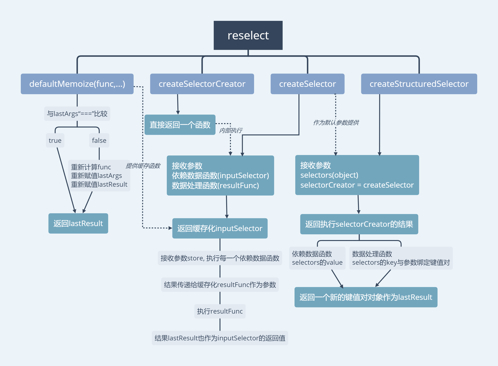

## reselect源码介绍

v3.0.1

导图：


### defaultMemoize

一个缓存函数，其内部：
1. 通过闭包保存参数和结果
2. 每次调用对参数进行浅比较
3. 参数比较结果相同，返回缓存的结果

```js
function defaultMemoize(func, equalityCheck = defaultEqualityCheck) {
  let lastArgs = null
  let lastResult = null
  return function () {
    // 判断当前参数和上一次的参数是否相同，默认为 ===(全等)
    if (!areArgumentsShallowlyEqual(equalityCheck, lastArgs, arguments)) {
      // apply arguments instead of spreading for performance.
      // 不同则调用func
      lastResult = func.apply(null, arguments)
    }
    // 保存当前参数
    lastArgs = arguments
    // 返回result
    return lastResult
  }
}
```
--------
### createSelectorCreator, createSelector

reselect最主要函数
1. `createSelectorCreator`接收一个参数，缓存函数，返回一个函数，称为`createSelector`

    `const createSelector = createSelectorCreator(defaultMemoize)`
    
2. `createSelector`接受2类参数

    `依赖数据函数`(可以有多个)：
    
    它的结果会传递给`数据处理函数`作为它的参数
    
    `数据处理函数`(必须放在参数的最后)：
    
    它接受的参数就是`依赖数据函数`的返回值
    
3. `createSelector`的内部操作
    1. 对`依赖数据函数`和`数据处理函数`执行缓存函数
    2. 每次执行`createSelector`的时候，会先执行`依赖数据函数`的缓存函数，检查参数是否相等，相等则返回旧的结果；
       如果不相等，才会再执行`数据处理函数`的缓存函数，进行比较。
    
       这样处理就可以知道要想返回缓存的结果，必须要达到以下条件任一：
       1. `依赖数据函数`的参数(一般为`store`)全等比较为true
       2. `依赖数据函数`的参数(一般为`store`)全等比较为false, `数据处理函数`的参数全等比较为true

4. 返回`依赖数据函数`

    [reselect使用例子](https://codesandbox.io/s/jlpozpjprw)

-------------

### createStructuredSelector

一个便利的函数，可以用于变更数据的key值，通过嵌套可以变更数据的结构

它的内部正是调用了`createSelector`

1. 接受2个函数，分别为一个(参数1)对象，一个(参数2)`selectorCreator`(默认就是createSelector)

2. 调用`createSelector`，将参数1(对象)的value值作为`依赖数据函数`，
其`数据处理函数`就是一个将参数1(对象)的key值和`依赖数据函数`的返回值组成一个新的对象的过程。

    [createStructuredSelector使用例子](https://codesandbox.io/s/53kvl30564)


--------
注意点：

1. 缓存函数只能保存上一次缓存的值(单个)。

2. 缓存函数是通过对比参数而进行判断的，因此必须保证所提供的`依赖数据函数`和`数据处理函数`都是纯函数，而且它只保存上一次函数。

    [非纯函数例子](https://codesandbox.io/s/n6y126v2p)
    
3. 要想取消缓存，必须取消引用，包括`依赖数据函数`参数(store)的引用和内部`数据处理函数`的参数引用

    [取消缓存例子](https://codesandbox.io/s/lx1kq3lj39)
