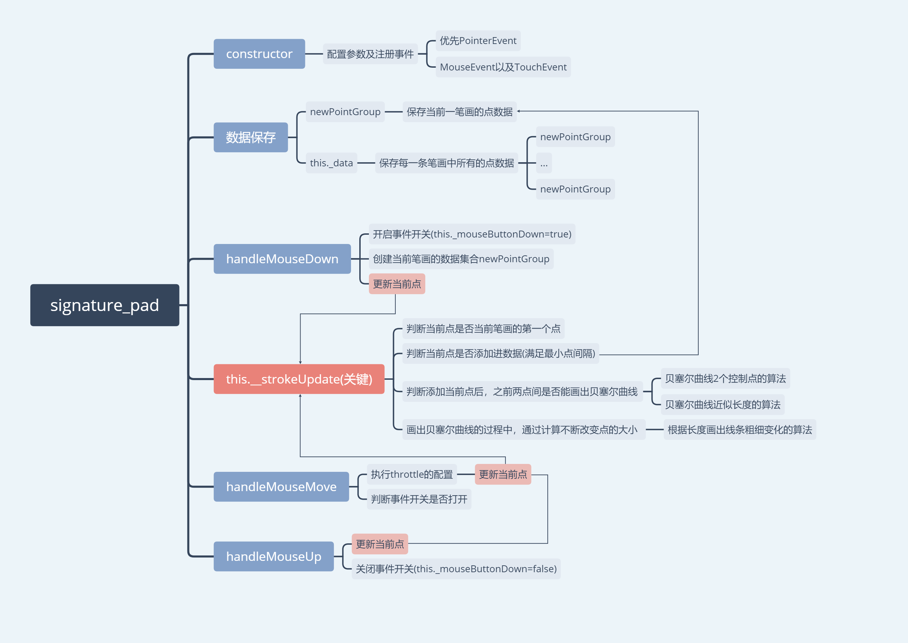

> `signature_pad`一个基于Canvas的平滑手写画板工具

---

#### 一些介绍

实现手写有多种方式。

一种比较容易做出的是对鼠标移动轨迹画点，再将两点之间以`直线`相连，最后再进行平滑处理，这种方案不需要什么算法支持，但同样，它面对一个性能和美观的抉择，打的点多，密集，性能相对较低，但更加美观，视觉上更平滑；

此处用的另一种方案，画贝塞尔曲线。

由于`canvas`没有默认的画出贝塞尔曲线方法，因此曲线是通过不断画出`一个个点`形成的，那么问题来了，这些点谁来定？

这里使用了贝塞尔曲线的一系列算法，包括`求控制点`，`求长度`，最后执行画点形成`线条时的粗细变化`。


#### 参数及配置介绍

提供的可配置参数如下

```
export interface IOptions {
  // 点的大小(不是线条)
  dotSize?: number | (() => number);
  // 最粗的线条宽度
  minWidth?: number;
  // 最细的线条宽度
  maxWidth?: number;
  // 最小间隔距离(这个距离用贝塞尔曲线填充)
  minDistance?: number;
  // 背景色
  backgroundColor?: string;
  // 笔颜色
  penColor?: string;
  // 节流的间隔
  throttle?: number;
  // 当前画笔速度的计算率，默认0.7，意思就是 当前速度=当前实际速度*0.7+上一次速度*0.3
  velocityFilterWeight?: number;
  // 初始回调
  onBegin?: (event: MouseEvent | Touch) => void;
  // 结束回调
  onEnd?: (event: MouseEvent | Touch) => void;
}
```

这里要注意的是并没有`线条粗细`这个选项，因为这里面的粗细不等线条都是通过一个个大小不同的点构造而成；
`throttle`这个配置可以参考`loadsh`或者`underscore`的`_.throttle`，功能一致，就是为了提高性能。


#### 注册事件

在`constructor`内部，除了配置传入的参数外，就是注册事件。

这里优先使用了[PointerEvent](https://developer.mozilla.org/zh-CN/docs/Web/API/PointerEvent)触点事件，`PointerEvent`可以说是触摸以及点击事件的一个统一，如果设备支持，不需要再分别为`mouse`和`touch`写两套事件了。


#### 状态数据储存

状态开关：

* `this._mouseButtonDown`

    当执行`move`事件时，会检查此状态，只有在`true`的情况下才会执行。

数据储存分为2种格式：

1. `pointGroup`
    
    这是当前笔画的点的一个集合，内部储存了当前笔画的颜色`color`和所有的点`points<Array>`。
    
2. `this._data`

    这是一个储存所有笔画的栈，格式为`[pointGroup, pointGroup, ..., pointGroup]`，当需要执行`undo`的时候，只需要删除`this._data`中的最后一条数据。

#### 事件流程及方法

##### `mouseDown`事件

当鼠标(触点)按下时，改变状态`this._mouseButtonDown = true`，调用`onBegin`回调，创建当前笔画的一个新的集合，然后对**当前点执行更新**。

##### `mouseMove`事件

首先检查`this._mouseButtonDown`状态，对**当前点执行更新**。

##### `mouseUp`事件

改变状态`this._mouseButtonDown = false;`，调用`onEnd`回调，对**当前点执行更新**。

可以看到，上面的每一个事件内部都调用对当前点执行更新的方法。

##### 点的更新方法`_strokeUpdate`

```js
private _strokeUpdate(event: MouseEvent | Touch): void {
    // 获取当前触点的位置
    const x = event.clientX;
    const y = event.clientY;

    // 创建点
    const point = this._createPoint(x, y);
    // 调出最后一个点集
    const lastPointGroup = this._data[this._data.length - 1];
    // 获取最后一个点集的点的数组
    const lastPoints = lastPointGroup.points;
    // 如果存在上一个点，获取上一个点
    const lastPoint =
      lastPoints.length > 0 && lastPoints[lastPoints.length - 1];
    // 判断上一个点到当前点是否太近(也就是小于配置的最小间隔距离)
    const isLastPointTooClose = lastPoint
      ? point.distanceTo(lastPoint) <= this.minDistance
      : false;
    // 调出点集的颜色
    const color = lastPointGroup.color;

    // Skip this point if it's too close to the previous one
    // 存在上一个点但是太近，跳过，其余的执行
    if (!lastPoint || !(lastPoint && isLastPointTooClose)) {
      // 向上一次的点数组中添加当前点，并且生成一个新的贝塞尔曲线实例
      // 包括4个点 （初始点，2个控制点，结束点）
      // 初始宽度，最终宽度
      const curve = this._addPoint(point);

      // 如果不存在lastPoint，即当前点是第一个点
      if (!lastPoint) {
        // 画一个点
        this._drawDot({ color, point });
      // 如果存在lastPoint 并且能形成一个贝塞尔曲线实例(3个点以上)
      } else if (curve) {
        // 画出参数中curve实例中两点之间的曲线
        this._drawCurve({ color, curve });
      }
      // 添加到当前笔画的点数组
      lastPoints.push({
        time: point.time,
        x: point.x,
        y: point.y,
      });
    }
  }
```

这个方法前面就是一系列判断

* 判断是否是第一个点
* 判断是否能加入点的集合(满足点的最小间隔)
* 判断是否能画出贝塞尔曲线(满足至少3个点)
    
    对于能画出贝塞尔曲线的点，执行算法，求出`Besier`实例，包括4个点`初始点`，`结束点`，`控制点1`，`控制点2`以及当前曲线中线条的的`初始宽度`和`结束宽度`。
    
    具体如何算的，请参考源码`src/bezier.ts`和[这篇文章](https://medium.com/square-corner-blog/smoother-signatures-be64515adb33)。

对于能画出贝塞尔曲线的，对已经求出的`Bezier`实例，执行`this._drawCurve`，否则执行`this._drawDot`

##### 画点的方法`this._drawDot`

获取配置中的`dotSize`，执行`canvas`画点。

##### 画线的方法`this.__drawCurve`

1. 求出当前`Bezier`实例`初始点`和`结束点`之间的距离，这个距离不是直线距离，而是贝塞尔曲线距离。

2. 对这个距离进行扩展，例如，计算得到距离为`50`，那就扩展为`100`个点，即我需要在`50`这个距离内画出`100`个点；
    
    这么做可以保证在正常或者稍微快速的书写中，不出现断层。
       
3. 接着又是[算法](https://medium.com/square-corner-blog/smoother-signatures-be64515adb33)，目的是求出这个距离内的每一个点的大小，这是一个变化值，是的粗细变化更加平滑。

4. 最后同样是`canvas`画点。


以上就是整个基本流程。


#### 总结

阅读一遍后，这个库说白就是基础的事件操作+贝塞尔曲线算法，但是，它内部的代码格式非常清晰，`细粒度+代码复用`使得维护起来非常方便。

同时可以对贝塞尔曲线有一个更深层的了解(算法还是没法手撕囧)，但起码有一个比较完整的思路；

一些可以借鉴的东西：

* [PointerEvent的优势](#注册事件)
* canvas+贝塞尔曲线
* 节流`throttle`的写法(参考源码src/throttle.ts)
* [数据结构及实现`undo`的方案](#状态数据储存)


#### 思维导图




> 贝塞尔曲线算法资料：
>  
>  * https://medium.com/square-corner-blog/smoother-signatures-be64515adb33
>  * https://www.lemoda.net/maths/bezier-length/index.html
