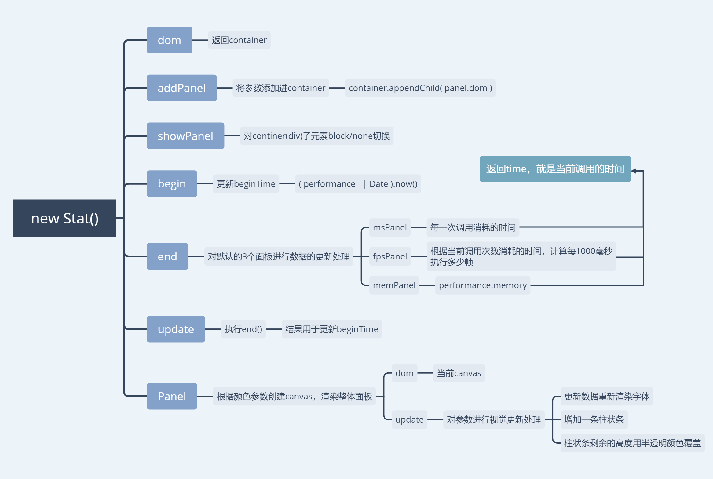

一个js性能监控器，使用canvas绘制，简洁美观，思想也不复杂

1. 通过`performance.now`获取当前开始时间，每次调用时，计算时间差，每隔1秒计算每一帧平均消耗的毫秒数，从而计算1000毫秒的帧数。

2. 根据传入的当前fps和给定的最高fps绘制canvas，分为整体层，字体层，柱状条层。

3. 因为不使用clearRect清除画布，每次新创建的柱状条不会被清除，从而展示出监测器的效果。

stat：

